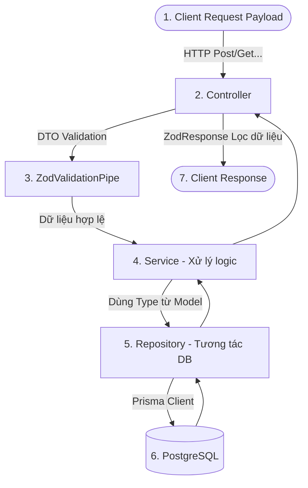

# 🚀 HƯỚNG DẪN QUY TRÌNH PHÁT TRIỂN TÍNH NĂNG MỚI (NESTJS + PRISMA + ZOD)

Tài liệu này hướng dẫn chi tiết quy trình từng bước (Step-by-Step) để thêm một tính năng hoặc một mô-đun mới vào dự án Backend của bạn. Quy trình này giúp bạn không bị quên các bước tạo DTO, Model, Type, Repository, Service và Controller, đảm bảo tính nhất quán của kiến trúc dự án.

---

## 🗺️ Luồng Dữ Liệu & Kiến Trúc Tổng Quan

Trước khi bắt đầu, hãy nhớ luồng đi của một Request từ client lên Server:



---

## 🛠️ Quy Trình 9 Bước Khi Thêm Tính Năng Mới

Giả sử chúng ta cần thêm tính năng quản lý sản phẩm yêu thích (ví dụ: **`wishlist`**).

### Bước 1: 🗄️ Thiết kế Cơ sở Dữ liệu (Prisma Schema)

Nếu tính năng mới yêu cầu lưu trữ dữ liệu mới, bạn phải cập nhật database trước tiên.

1. Mở file [schema.prisma](file:///d:/SourceDoan/be-source-doan/prisma/schema.prisma) và định nghĩa model mới.

   ```prisma
   model Wishlist {
     id        Int      @id @default(autoincrement())
     userId    Int
     user      User     @relation(fields: [userId], references: [id], onDelete: Cascade)
     productId Int
     product   Product  @relation(fields: [productId], references: [id], onDelete: Cascade)
     createdAt DateTime @default(now())

     @@unique([userId, productId])
   }
   ```

2. Chạy lệnh cập nhật database trong terminal:
   ```bash
   pnpm prisma:migrate    # Tạo file migration nếu chạy ở dev (hoặc dùng pnpm prisma:push)
   pnpm prisma:generate   # Tạo lại Prisma Client Types
   ```

---

### Bước 2: 📁 Tạo Thư Mục Mô-đun Mới

Tạo thư mục mới trong `src/routes/`.

```bash
src/routes/wishlist/
```

Trong thư mục này, bạn sẽ tạo 7 file chuẩn chỉnh:

1. `wishlist.model.ts` (Quy tắc validate của Zod & TypeScript types)
2. `wishlist.dto.ts` (Class DTO phục vụ tầng HTTP của NestJS)
3. `wishlist.repo.ts` (Repository làm việc trực tiếp với database thông qua Prisma)
4. `wishlist.service.ts` (Service xử lý logic nghiệp vụ)
5. `wishlist.controller.ts` (Controller đón nhận HTTP request)
6. `wishlist.module.ts` (Module của NestJS để khai báo và kết nối các thành phần)
7. `wishlist.constant.ts` (Nếu có hằng số riêng cho module này)

---

### Bước 3: 📝 Định nghĩa Model & Validate (`wishlist.model.ts`)

- **Mục đích:** Định nghĩa **Zod Schema** để validate dữ liệu đầu vào và suy luận ra **TypeScript Type** cho tầng Service.

```typescript
import z from 'zod';

// 1. Định nghĩa Zod Schema cho dữ liệu thêm sản phẩm vào wishlist
export const AddWishlistBodySchema = z
  .object({
    productId: z.number().int().positive('Product ID phải là số nguyên dương'),
  })
  .strict();

// 2. Suy luận (infer) ra TypeScript Type cho tầng Service sử dụng
export type AddWishlistBodyType = z.infer<typeof AddWishlistBodySchema>;

// 3. Định nghĩa Schema cho dữ liệu trả về (Response)
export const WishlistResSchema = z.object({
  id: z.number(),
  userId: z.number(),
  productId: z.number(),
  createdAt: z.date(),
});

export type WishlistResType = z.infer<typeof WishlistResSchema>;
```

---

### Bước 4: 📦 Tạo DTO Class (`wishlist.dto.ts`)

- **Mục đích:** Chuyển đổi Zod Schema thành NestJS Class để dùng ở Controller.

```typescript
import { createZodDto } from 'nestjs-zod';
import { AddWishlistBodySchema, WishlistResSchema } from './wishlist.model';

// Tạo DTO cho Body gửi lên
export class AddWishlistBodyDTO extends createZodDto(AddWishlistBodySchema) {}

// Tạo DTO cho Response trả về
export class WishlistResDTO extends createZodDto(WishlistResSchema) {}
```

---

### Bước 5: 💾 Tạo Repository (`wishlist.repo.ts`)

- **Mục đích:** Chỉ làm việc với Database. Tách biệt hoàn toàn các câu lệnh truy vấn Prisma ra khỏi Service.

```typescript
import { Injectable } from '@nestjs/common';
import { PrismaService } from 'src/shared/repositories/prisma.service'; // Đường dẫn thực tế của bạn

@Injectable()
export class WishlistRepository {
  constructor(private readonly prisma: PrismaService) {}

  async create(userId: number, productId: number) {
    return this.prisma.wishlist.create({
      data: {
        userId,
        productId,
      },
    });
  }

  async findManyByUserId(userId: number) {
    return this.prisma.wishlist.findMany({
      where: { userId },
      include: { product: true },
    });
  }

  async delete(userId: number, productId: number) {
    return this.prisma.wishlist.delete({
      where: {
        userId_productId: { userId, productId },
      },
    });
  }
}
```

---

### Bước 6: ⚙️ Tạo Service (`wishlist.service.ts`)

- **Mục đích:** Xử lý toàn bộ logic nghiệp vụ (kiểm tra điều kiện, xử lý lỗi, gọi Repository).
- **Lưu ý:** Ở đây chúng ta chỉ dùng kiểu dữ liệu **`Type`** từ file `model.ts`.

```typescript
import { Injectable, BadRequestException } from '@nestjs/common';
import { WishlistRepository } from './wishlist.repo';
import { AddWishlistBodyType } from './wishlist.model';

@Injectable()
export class WishlistService {
  constructor(private readonly wishlistRepo: WishlistRepository) {}

  async addToWishlist(userId: number, body: AddWishlistBodyType) {
    try {
      return await this.wishlistRepo.create(userId, body.productId);
    } catch (error) {
      throw new BadRequestException('Sản phẩm đã tồn tại trong danh sách yêu thích');
    }
  }

  async getWishlist(userId: number) {
    return await this.wishlistRepo.findManyByUserId(userId);
  }
}
```

---

### Bước 7: 🎮 Tạo Controller (`wishlist.controller.ts`)

- **Mục đích:** Khai báo Endpoint API, kiểm tra phân quyền và đón nhận Request.
- **Lưu ý:** Sử dụng **`DTO`** để khai báo kiểu dữ liệu cho `@Body()` và sử dụng `@ZodResponse` để lọc response.

```typescript
import { Body, Controller, Get, Post, UseGuards } from '@nestjs/common';
import { ZodResponse } from 'nestjs-zod';
import { WishlistService } from './wishlist.service';
import { AddWishlistBodyDTO, WishlistResDTO } from './wishlist.dto';
import { CurrentUser } from 'src/shared/decorators/current-user.decorator'; // Custom decorator của bạn
import { AuthGuard } from 'src/shared/guards/auth.guard'; // Guard check đăng nhập

@Controller('wishlist')
@UseGuards(AuthGuard) // Bắt buộc đăng nhập
export class WishlistController {
  constructor(private readonly wishlistService: WishlistService) {}

  @Post()
  @ZodResponse(WishlistResDTO) // Lọc dữ liệu trả về theo schema
  async add(@CurrentUser('id') userId: number, @Body() body: AddWishlistBodyDTO) {
    return await this.wishlistService.addToWishlist(userId, body);
  }

  @Get()
  async get(@CurrentUser('id') userId: number) {
    return await this.wishlistService.getWishlist(userId);
  }
}
```

---

### Bước 8: 🧩 Tạo Module (`wishlist.module.ts`)

- **Mục đích:** Gom tất cả các file trên lại và đăng ký với Dependency Injection của NestJS.

```typescript
import { Module } from '@nestjs/common';
import { WishlistController } from './wishlist.controller';
import { WishlistService } from './wishlist.service';
import { WishlistRepository } from './wishlist.repo';

@Module({
  controllers: [WishlistController],
  providers: [WishlistService, WishlistRepository],
})
export class WishlistModule {}
```

---

### Bước 9: 🔌 Kích hoạt Module trong Module gốc (`src/app.module.ts`)

Cuối cùng, hãy nhớ đăng ký mô-đun mới của bạn vào danh sách `imports` của [app.module.ts](file:///d:/SourceDoan/be-source-doan/src/app.module.ts) để hệ thống nhận diện.

```typescript
import { WishlistModule } from './routes/wishlist/wishlist.module'; // Import module mới

@Module({
  imports: [
    SharedModule,
    AuthModule,
    WishlistModule, // <--- THÊM VÀO ĐÂY!
  ],
  controllers: [AppController],
  providers: [ ... ],
})
export class AppModule {}
```

---

## 📋 Checklist Nhanh Để Copy Khi Code Tính Năng Mới

Copy checklist dưới đây vào ghi chú cá nhân của bạn mỗi khi bắt đầu tính năng mới:

- [ ] **B1:** Sửa file `schema.prisma` và chạy `pnpm prisma:migrate` + `generate` (nếu cần).
- [ ] **B2:** Tạo thư mục mô-đun mới trong `src/routes/`.
- [ ] **B3:** Viết file `.model.ts` (Chứa Zod Schema và `z.infer` Types).
- [ ] **B4:** Viết file `.dto.ts` (Chứa các class DTO kế thừa từ `createZodDto`).
- [ ] **B5:** Viết file `.repo.ts` (Nhúng `PrismaService` và viết các hàm thao tác DB).
- [ ] **B6:** Viết file `.service.ts` (Nhúng Repository, xử lý logic bằng tham số có kiểu dữ liệu `Type` từ model).
- [ ] **B7:** Viết file `.controller.ts` (Định nghĩa endpoint, `@Body() body: DTO`, `@ZodResponse`).
- [ ] **B8:** Viết file `.module.ts` (Đăng ký Controller, Service, Repository).
- [ ] **B9:** Đăng ký module mới vào `imports` của `src/app.module.ts`.
- [ ] **B10:** Test API bằng Postman / Thunder Client / Swagger. Done! 🎉
